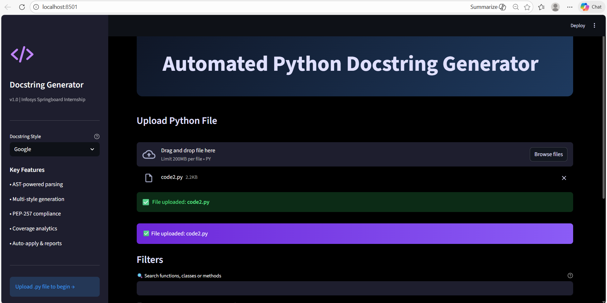
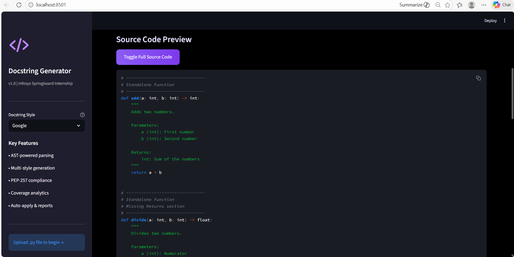
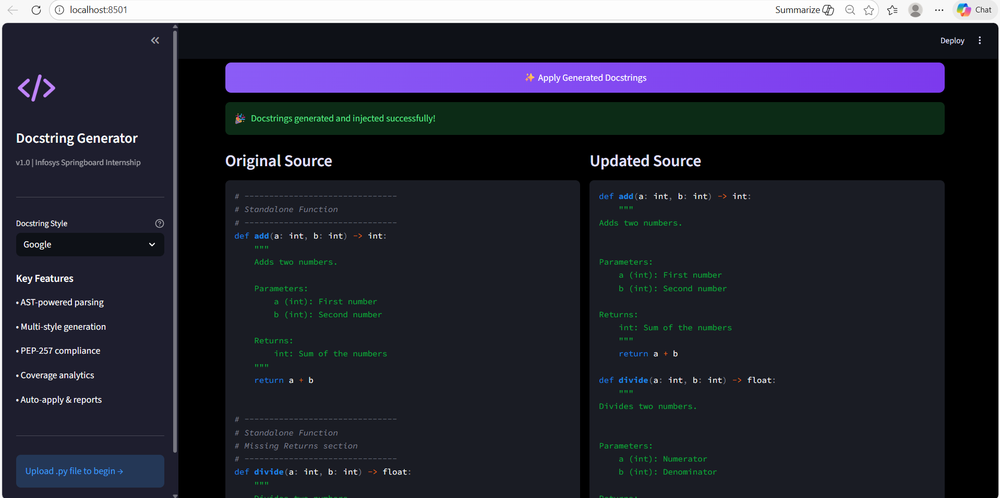
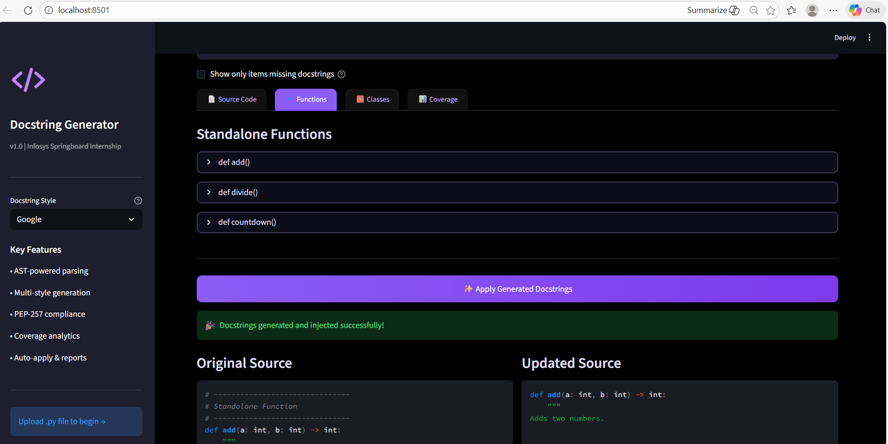
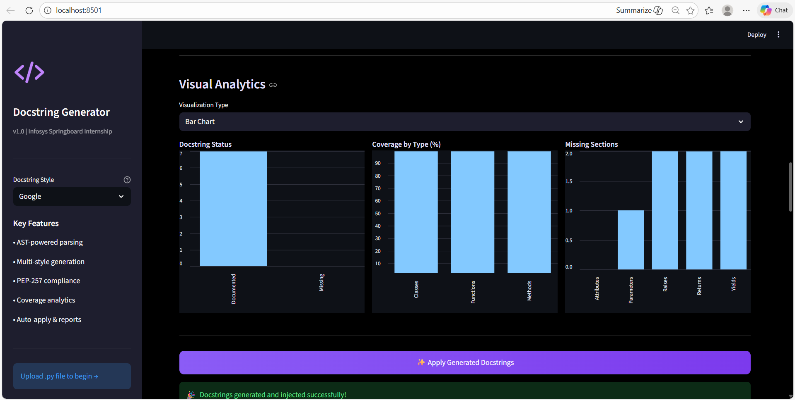

# Automated Python Docstring Generator

[](https://www.python.org/)
[](https://opensource.org/licenses/MIT)
[](.pre-commit-config.yaml)
[](https://streamlit.io/)

**A complete, pip-installable tool** that automatically generates docstrings, analyzes coverage, enforces PEP-257 compliance, and offers an interactive UI + CLI.

Built during **Infosys Springboard Internship** — **Milestone 4 fully completed**.

## ✨ Features

- AST-based parsing of functions, classes, parameters, returns, and type hints
- Generate docstrings in **Google**, **NumPy**, or **reST** style
- Detailed coverage reports (percentage, missing sections, non-compliant items)
- PEP-257 compliance checking with pydocstyle
- **Beautiful Streamlit UI** with:
  - File upload & source preview
  - Search by name (case-insensitive)
  - Filter "Show only missing docstrings"
  - Tooltips on style selector
  - One-click generate & apply docstrings
  - Download updated code & reports (CSV, Python file)
- Robust CLI for batch processing folders or single files
- Edge-case tested (empty files, syntax errors, no docstrings)
- Pre-commit hooks for code quality (black, whitespace, yaml)
- GitHub Actions CI pipeline

## 🚀 Installation

```bash
# Clone the repository
git clone https://github.com/keerthireddy2006/Automated-Python-Docstring-Generator.git
cd Automated-Python-Docstring-Generator

# Install in editable mode (recommended for development & demo)
pip install -e .
Quick Usage
1. Interactive UI (best for demonstration)
Bashstreamlit run app.py
What you can do in the UI:

Upload any Python (.py) file
See source code preview
View all functions & classes with existing/generated docstrings
Search by name (e.g. "add")
Check "Show only missing docstrings"
Generate docstrings in chosen style
Apply changes with one button
Download the updated file

2. Command-Line Interface (CLI)
Bash# Single file
autodocstring calculator.py --style Google --verbose

# Check entire folder
autodocstring samples/ --min-coverage 80 --verbose

# Run directly without install
python src/autodocstring/cli.py math.py --style NumPy
CLI Flags

--style {Google, NumPy, reST} — default: Google
--min-coverage float — fail if any file below this (default: 80.0)
--verbose — detailed per-file output

3. Run Tests
Bashpytest -v
All tests pass (CLI behavior, empty files, syntax errors, coverage checks).
📸 Screenshots
Streamlit UI – Main Dashboard

UI – Search Example

UI – Missing Docstrings Filter

UI – Coverage View

UI – Apply Docstrings

CLI – Verbose Output
CLI Output
Project Structure
textAutomated-Python-Docstring-Generator/
├── src/
│   └── autodocstring/
│       ├── __init__.py
│       ├── __main__.py
│       ├── cli.py          # Command-line interface
│       ├── parser.py       # AST parsing
│       ├── generator.py    # Docstring generation
│       ├── coverage.py     # Coverage analysis
│       ├── compliance.py   # PEP-257 compliance
│       ├── injector.py     # Apply docstrings
│       └── ...             # other modules
├── app.py                  # Streamlit UI
├── tests/                  # Pytest suite
├── samples/                # Example Python files
├── .github/workflows/      # CI pipeline
├── .pre-commit-config.yaml # Code quality hooks
├── pyproject.toml
└── README.md
Development & Tools Used

Python 3.9+
AST for parsing
pydocstyle for PEP-257
Streamlit for UI
pytest for testing
pre-commit + black for style
GitHub Actions for CI

Final Milestone 4 Status

Pip-installable package → Done
Robust tests for edge cases → Done
Improved Streamlit UI (search, filters, tooltips) → Done
Published documentation & usage guides → Done

Project fully complete, tested, documented, and pushed to GitHub.
Thank you for reviewing — Infosys Springboard Internship.
Built with passion by Nkeerthi.
Ready for feedback & future work (LLM integration, auto-fixing, etc.)!