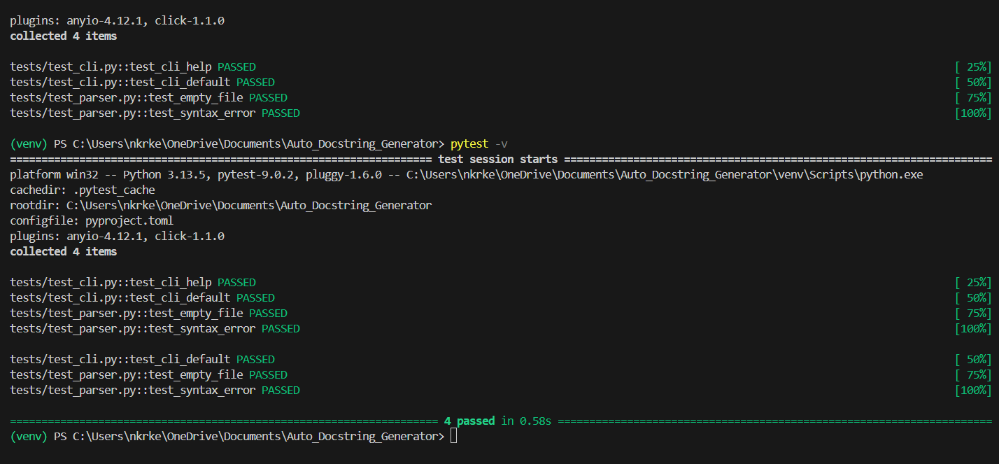

# Automated Python Docstring Generator

[](https://www.python.org/)
[](https://opensource.org/licenses/MIT)
[](.pre-commit-config.yaml)
[](https://streamlit.io/)

**A powerful, pip-installable tool** that automatically generates docstrings, analyzes documentation coverage, enforces PEP-257 compliance, and provides an interactive UI.

Built during **Infosys Springboard Internship** — **Milestone 4 fully completed**.

## ✨ Features

- AST-powered parsing of functions, classes, parameters, returns, and type hints
- Generate docstrings in **Google**, **NumPy**, or **reST** style
- Detailed coverage reports (percentage, missing sections, non-compliant items)
- PEP-257 compliance checking with pydocstyle
- **Beautiful Streamlit UI** with:
  - File upload & source preview
  - Search by name (case-insensitive)
  - Filter "Show only missing docstrings"
  - Tooltips on style selector
  - One-click generate & apply docstrings
  - Download updated code & reports (CSV, Python file)
- Robust CLI for batch processing folders or single files
- Edge-case tested (empty files, syntax errors, no docstrings)
- Pre-commit hooks for code quality (black, whitespace, yaml)
- GitHub Actions CI pipeline

## 🚀 Installation

```bash
# Clone the repository
git clone https://github.com/keerthireddy2006/Automated-Python-Docstring-Generator.git
cd Automated-Python-Docstring-Generator

# Install in editable mode (recommended for development & demo)
pip install -e .

Usage
UI
Bashstreamlit run app.py
Upload file → search → filter missing → apply docstrings.
CLI
Bashautodocstring calculator.py --style Google --verbose
autodocstring samples/ --min-coverage 80 --verbose
Tests
Bashpytest -v
Screenshots
UI – Main Dashboard

UI – Search Example

UI – Missing Filter

UI – Coverage View

UI – Apply Docstrings

CLI – Verbose Output

Project Structure
textAutomated-Python-Docstring-Generator/
├── src/
│   └── autodocstring/
│       ├── __init__.py
│       ├── __main__.py
│       ├── cli.py
│       ├── parser.py
│       ├── generator.py
│       ├── coverage.py
│       ├── compliance.py
│       ├── injector.py
│       └── ...
├── app.py
├── tests/
├── samples/
├── .github/workflows/
├── .pre-commit-config.yaml
├── pyproject.toml
└── README.md
Milestone 4 Status

Pip-installable package → Done
Robust tests → Done
UI improvements → Done
Documentation & guides → Done

Thank you!
Nkeerthi